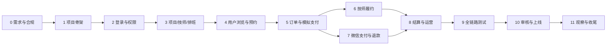

# 到家按摩小程序开发计划

> 文档状态：阶段 1 已确认并实施，阶段 2 及以后待确认  
> 目标：从需求冻结开始，完成开发、测试、微信审核和正式上线  
> 开发前提：项目方确认本目录全部方案

## 1. 计划假设

### 1.1 建议人员

| 角色 | 投入 |
| --- | --- |
| 产品/项目负责人 | 0.5 人，负责规则确认、验收和素材 |
| UI/UX 设计 | 0.5 人，前期集中投入 |
| 原生小程序开发 | 1 人 |
| Java 后端开发 | 1 人 |
| 测试 | 0.5 至 1 人，中后期集中投入 |
| 运维 | 后端兼任或 0.2 人 |

在上述人员可以并行工作的情况下，P0 正式上线预计 14 至 18 周；只有一名全栈开发时预计 24 至 30 周。该估算不包含主体资质、小程序类目或微信支付商户申请的外部等待时间。

### 1.2 完成定义

一个阶段只有同时满足以下条件才算完成：

- 该阶段范围已开发，不遗留阻断下一阶段的临时代码。
- 自动化测试、人工测试和文档更新完成。
- 验收标准有实际验证记录。
- 发现的 P0/P1 缺陷已关闭，P2 缺陷有明确处理决定。
- 产品负责人确认阶段结果。

## 2. 阶段总览

| 阶段 | 目标 | 建议工期 | 关键产物 |
| --- | --- | --- | --- |
| 0 | 需求、合规和账号准备 | 1-2 周 | 冻结 PRD、资质清单、原型 |
| 1 | 项目骨架与基础设施 | 1 周 | 可部署空项目、数据库迁移、CI |
| 2 | 登录、角色、文件与区域 | 1-1.5 周 | 三角色登录和服务范围基础 |
| 3 | 项目、技师、定价和排班 | 2 周 | 管理员可完成供给上架 |
| 4 | 用户浏览、地址与预约预览 | 1.5-2 周 | 用户可走到订单确认页 |
| 5 | 订单与模拟支付 | 2 周 | 模拟支付下的订单闭环 |
| 6 | 技师履约与通知 | 1.5-2 周 | 技师完整服务流程 |
| 7 | 真实微信支付、退款和售后 | 2 周 | 真实支付退款闭环 |
| 8 | 人工结算与运营功能 | 1.5 周 | 收入、结算、优惠券和内容 |
| 9 | 全链路测试、安全和性能 | 2 周 | 验收报告、修复记录 |
| 10 | 体验版验收、审核与上线 | 1-2 周+外部等待 | 生产版本和回滚方案 |
| 11 | 上线观察和项目收尾 | 1-2 周 | 监控复盘、运维手册、V1 验收 |

阶段 0 必须先完成；阶段 3 开始后，小程序和后端可以按已冻结接口并行开发。

## 3. 阶段 0：需求冻结与外部准备

### 目标

确保业务规则、合规材料和微信侧账号条件足以支持开发，避免完成代码后因类目或商户条件无法上线。

### 工作项

- 确认 [README.md](./README.md) D-01 至 D-10。
- 确认上门费、技师收入、平台服务费和结算规则。
- 确认取消、退款、投诉和服务异常处理规则。
- 输出所有页面低保真原型和关键页面高保真视觉稿。
- 确定品牌名、Logo、主色、项目图片和技师工作照规范。
- 准备小程序主体、服务类目、隐私保护指引和经营资质。
- 准备微信支付商户号、API 证书、回调域名和结算账户。
- 准备服务器、数据库、Redis、COS 和地图账号。
- 确认东莞首批服务镇街和首批项目/技师数据。
- 冻结 API 第一版和数据库核心模型。

### 验收

- PRD 无未决定的 P0 业务规则。
- 核心页面原型覆盖三种角色和全部 P0 流程。
- 微信小程序及支付申请条件由负责人核验，不存在已知阻断项。
- 测试账号、云资源和域名负责人明确。

## 4. 阶段 1：项目骨架与基础设施

> 实施状态：工程实现完成；Docker 容器实启和微信体验版联调待外部工具与账号就绪后验收。详见 [PHASE_1_SETUP.md](./PHASE_1_SETUP.md)。

### 小程序

- 创建原生 TypeScript 小程序项目。
- 配置主包及用户、技师、管理员分包。
- 建立请求封装、令牌处理、错误提示和环境配置。
- 建立设计令牌、基础按钮、表单、空态、加载和状态组件。
- 配置代码检查和基础单元测试能力。

### 后端

- 创建 Spring Boot 模块化单体工程。
- 接入 Spring Security、MyBatis-Plus、MySQL、Redis 和 Flyway。
- 建立统一响应、错误码、异常处理、requestId 和日志脱敏。
- 建立 local/test/staging/production 配置模板。
- 提供健康检查和 OpenAPI 文档。

### 部署

- 创建 Docker 和 Nginx 配置。
- 建立测试环境自动构建和部署流程。
- 建立数据库迁移、备份脚本和密钥管理方式。

### 验收

- 小程序体验版能调用测试环境健康接口。
- 后端可以从空数据库运行迁移并启动。
- 提交代码后自动运行检查和测试。
- 配置文件和日志中没有明文生产密钥。

## 5. 阶段 2：登录、权限、区域与文件

### 开发内容

- 微信登录和平台访问令牌。
- 手机号绑定、用户资料和账号状态。
- 用户、技师、管理员和超级管理员角色。
- 管理权限组和接口权限校验。
- 小程序身份选择和角色切换。
- 东莞行政区、服务区域和地址选点基础。
- COS 文件上传、文件用途校验和私有文件访问。
- 协议读取、用户同意记录和隐私入口。
- 审计日志基础能力。

### 测试重点

- 未登录、令牌过期和禁用账号。
- 普通用户伪造技师/管理员请求。
- 技师读取其他技师数据。
- 管理员不同权限组访问。
- 非法文件、超大文件和无权文件访问。

### 验收

- 同一微信账号可以按已授权角色切换工作台。
- 无权限请求全部由后端拒绝，而不是只隐藏前端入口。
- 东莞以外地址得到明确不可服务结果。
- 私有资质文件不能通过永久公开 URL 访问。

## 6. 阶段 3：项目、技师、定价与排班

### 管理端

- 分类新增、编辑、排序和停用。
- 项目新增、编辑、图文、基础价、上下架和排序。
- 技师入驻审核、补充资料、拒绝、暂停和恢复。
- 技师服务区域、项目绑定和独立价格。
- 管理员代排班和档期查看。

### 技师端

- 入驻申请和审核进度。
- 资料、照片和证书提交。
- 上线/休息状态。
- 排班、临时休息和已占用时段。
- 只读查看项目、价格和预计收入规则。

### 用户端

- 只展示已审核、已上架和有可预约档期的供给数据。

### 自动化测试

- 基础价和技师独立价优先级。
- 项目或技师停用后的可见性和可下单性。
- 证书过期、排班冲突和有效时段计算。
- 修改价格不影响已有订单快照的预备测试。

### 验收

- 管理员能在小程序内从零创建分类和项目，并上架一名技师。
- 同一项目可给不同技师设置不同价格。
- 技师无法自行改价或给自己绑定项目。
- 冲突排班被阻止并显示原因。

## 7. 阶段 4：用户浏览、地址与预约预览

### 开发内容

- 首页聚合、轮播图占位、项目分类和推荐供给。
- 项目列表、筛选和详情。
- 技师列表、筛选、详情、评价占位和可约日历。
- 地址新增、编辑、删除、默认地址和地图选点。
- 从项目选择技师、从技师选择项目两条路径。
- 预约时间选择和价格预览接口。
- 上门费、优惠和应付金额明细展示。
- 价格变化、档期占用和地址超区的重新确认交互。

### 测试重点

- 空项目、无技师、无可约时间和定位拒绝。
- 列表分页、快速切换筛选和重复加载。
- 价格在确认页停留期间被管理员修改。
- 地址边界和距离计算失败。

### 验收

- 用户可以从首页走到一份由后端计算的订单预览。
- 两条下单入口最终得到一致的项目、技师、时间和价格。
- 前端修改请求金额不会影响后端返回的应付金额。
- 页面在加载、空数据和错误情况下都有清晰状态。

## 8. 阶段 5：订单核心与模拟支付

### 开发内容

- 订单号、项目/价格/地址/协议快照。
- 时段短锁、待支付锁和超时释放。
- 订单状态机和状态日志。
- 订单创建幂等和乐观锁。
- MockPaymentGateway：成功、失败、处理中和重复通知模拟。
- 用户订单列表、详情、待支付和取消。
- 管理员订单列表、搜索、详情、备注和异常状态处理。
- 优惠券最小能力：发券、锁券、支付核销、关闭释放。
- 超时订单和支付补偿定时任务。

### 必须自动化覆盖

- 两名用户抢同一技师同一时段，只有一笔成功。
- 重复点击创建订单只生成一笔业务订单。
- 重复支付通知只完成一次支付和状态迁移。
- 支付金额不一致不能将订单标记已支付。
- 未支付超时释放时段和优惠券。
- 已支付订单不能被未支付超时任务关闭。

### 验收

- 不连接真实微信支付也能跑通创建、支付、接单前取消和超时关闭。
- 订单状态和支付状态可独立查询且保持一致。
- 每次状态改变都有日志和操作者。

## 9. 阶段 6：技师履约、改派与通知

### 开发内容

- 技师新订单、接单倒计时、接单和拒单。
- 管理员处理拒单和超时订单。
- 用户确认后的管理员改派。
- 技师出发、到达、服务码开始和完成。
- 最低合理服务时长校验。
- 用户实时查看订单进度。
- 站内消息和微信订阅消息任务。
- 异常上报、用户失联和管理员代确认。
- 待评价和自动完成。

### 测试重点

- 技师重复接单、过期接单和其他技师接单。
- 技师跳过状态、过早完成和重复完成。
- 改派到无档期、无项目或超服务区技师。
- 通知发送失败不回滚订单状态。

### 验收

- 一笔模拟支付订单可以完成“接单到完成服务”全流程。
- 用户、技师和管理员看到的状态一致。
- 改派保留完整原技师、新技师、原因和用户确认记录。

## 10. 阶段 7：真实微信支付、退款与售后

### 微信支付

- 接入真实小程序预支付。
- 支付签名、通知验签、解密、金额和商户校验。
- 支付查单、关单和异常补偿。
- 支付流水查询和基础对账。

### 退款售后

- 用户取消和售后申请。
- 管理员审核、部分/全额退款。
- 微信退款、退款通知和主动查询。
- 评价、投诉、处理记录和凭证。
- 售后对技师收入的冻结。

### 必须测试的支付场景

- 正常支付、用户取消支付和支付超时。
- 前端显示失败但微信实际已支付。
- 支付通知重复、延迟、乱序、金额不符和签名错误。
- 全额退款、部分退款、重复退款和退款失败。
- 订单已取消但迟到支付通知的人工处理路径。

### 验收

- 微信测试/正式商户环境完成至少一笔真实小额支付和退款。
- 支付成功只能由可信微信通知或主动查单确认。
- 退款失败不会显示已退款，管理员可以继续处理。
- 支付和退款可按平台单号及微信单号追踪。

## 11. 阶段 8：人工结算与运营功能

### 财务结算

- 订单收入明细和售后冻结。
- 可结算池和按技师/周期汇总。
- 创建、复核、付款登记、凭证和作废结算单。
- 技师收入和结算记录。
- 已结算订单的售后反向调整。

### 运营

- 轮播图、公告和协议版本。
- 优惠券完整规则、领取和手动发放。
- 基础经营统计。
- 评价审核、投诉工作台和资质到期提醒。
- P1 若排期允许：CSV 导出、收藏、结算申诉。

### 必须测试

- 同一收入明细不能进入两张结算单。
- 未过保护期、退款中或已退款订单不能结算。
- 结算金额由系统汇总，前端篡改金额无效。
- 作废、重新结算和已结算后退款调整。

### 验收

- 管理员可以从完成订单创建结算单，线下付款后登记凭证。
- 技师可以看到金额来源和结算结果。
- 每笔订单能够对应支付、退款、收入和结算记录。

## 12. 阶段 9：全链路测试与质量收口

### 功能回归

- 覆盖 [PRD.md](./PRD.md) 的全部 P0 页面和验收标准。
- 三种角色分别执行正常、异常和越权流程。
- 重点验证跨午夜预约、证书到期、价格变更、技师停用和订单售后。

### 兼容性

- 至少两种主流 iPhone 尺寸和微信版本。
- 至少两种主流 Android 厂商设备和微信版本。
- 小屏、全面屏安全区、字体放大、弱网、断网重试。

### 性能

- 首页、项目、技师和订单列表压测。
- 同一热门技师时段的并发下单压测。
- 支付通知和定时任务并发验证。
- 图片大小、首包体积、分包和页面加载检查。

### 安全

- 用户/技师/管理员横向和纵向越权。
- 文件上传和私有文件访问。
- SQL 注入、XSS/富文本、重复请求和频率限制。
- 日志、导出、错误信息和小程序包敏感信息检查。

### 数据与恢复

- 数据库全量备份和恢复演练。
- 支付成功但订单未更新的补偿演练。
- 定时任务重复执行和服务重启恢复。

### 验收门槛

- P0 缺陷为 0。
- P1 缺陷为 0；确需延期必须由产品负责人书面接受。
- 核心自动化测试全部通过。
- PRD 12 项验收标准全部有测试记录。
- 恢复演练、支付对账和安全检查通过。

## 13. 阶段 10：体验版、微信审核与上线

### 上线前

- 导入正式项目、价格、技师、排班、协议和客服信息。
- 配置生产域名、HTTPS、支付回调、COS 和地图密钥。
- 验证生产数据库迁移、备份、告警和日志。
- 准备小程序名称、简介、截图、隐私保护指引和审核说明。
- 准备演示账号和审核路径，确保审核人员可看到正规服务流程。
- 完成业务、财务、客服和技师操作培训。

### 发布步骤

1. 冻结上线候选版本。
2. 在 staging 完成最终回归。
3. 上传微信体验版并业务验收。
4. 提交微信审核，处理审核反馈。
5. 审核通过后，在低业务时段执行生产数据库迁移。
6. 发布后端并完成健康检查。
7. 发布小程序版本。
8. 使用真实账号完成一笔小额支付、履约和退款冒烟测试。
9. 观察错误、支付通知、订单和服务器指标。

### 回滚方案

- 小程序保留上一个稳定版本，可在平台侧回退。
- 后端保留前一镜像和兼容数据库变更。
- 破坏性数据库变更不得与首次发布同批执行。
- 支付故障时可临时关闭新下单入口，但继续允许查看和处理已有订单。

### 验收

- 微信审核通过并正式发布。
- 真实支付、通知、退款和订阅消息冒烟测试通过。
- 客服能处理订单、退款和投诉；财务能查询支付和结算。
- 监控、告警和回滚联系人明确。

## 14. 阶段 11：上线观察与项目收尾

### 上线后 7 至 14 天

- 每日核对支付金额、订单状态、退款和结算。
- 每日复盘错误日志、慢请求和通知失败。
- 跟踪下单转化、支付失败、拒单、取消和投诉原因。
- 修复线上 P0/P1 问题，并完整回归。
- 检查技师排班、服务码和管理员移动操作是否顺畅。

### 收尾产物

- 生产部署和回滚手册
- 数据库备份恢复手册
- 支付退款排障手册
- 管理员和客服使用手册
- 技师使用手册
- 已知问题和后续版本候选清单
- V1 验收报告

### 项目完成标准

- 正式环境连续 7 天无未解决 P0/P1 故障。
- 支付、订单和结算账目可核对，没有无法解释的差异。
- 产品负责人签署 V1 验收结果。
- 源码、配置模板、文档、账号权限和运维责任完成交接。

## 15. 依赖关系与并行方式

小程序开发可在后端完成 OpenAPI 契约后使用模拟数据并行；支付、退款和结算不能在订单状态机未稳定前抢先开发。

## 16. 里程碑

| 里程碑 | 达成条件 |
| --- | --- |
| M1 供给可配置 | 管理员可以上架项目、技师、价格和排班 |
| M2 用户可下单 | 用户可完成预约预览和模拟支付 |
| M3 服务可履约 | 技师可以从接单走到完成服务 |
| M4 资金可闭环 | 真实支付、退款、收入和人工结算可核对 |
| M5 候选发布 | P0 功能完成，全链路、安全和恢复测试通过 |
| M6 正式完成 | 微信上线、稳定观察和 V1 验收完成 |

## 17. 每阶段通用检查清单

### 产品

- 页面和业务规则符合已确认 PRD。
- 空态、加载、失败、无权限和重复操作有处理。
- 没有偷偷加入未确认的功能或配置项。

### 开发

- 所有改动可追溯到当前阶段需求。
- API、数据库迁移和错误码同步更新文档。
- 日志不泄露敏感数据，关键操作有审计。

### 测试

- 正常流、边界、失败、重试、重复提交和越权均有测试。
- 修复缺陷时先建立可复现步骤或自动化测试。
- 上一阶段核心回归保持通过。

### 发布

- 环境配置、迁移、备份、监控和回滚已验证。
- 第三方账号和密钥由指定负责人管理。
- 阶段验收结果有记录。

## 18. 开发启动前最终确认

项目方确认以下内容后才进入阶段 1：

1. [PRD.md](./PRD.md) 的 P0 范围和页面清单。
2. [README.md](./README.md) 的 D-01 至 D-10。
3. 技师应结金额和上门费的计算方式。
4. 微信小程序主体、类目和支付商户申请可行。
5. 技术栈、人员投入、预计工期和环境费用。
6. 阶段验收负责人和最终上线负责人。

任何开发阶段新增功能，都应先更新 PRD、评估对订单和资金的影响，并由项目方确认后进入排期。
