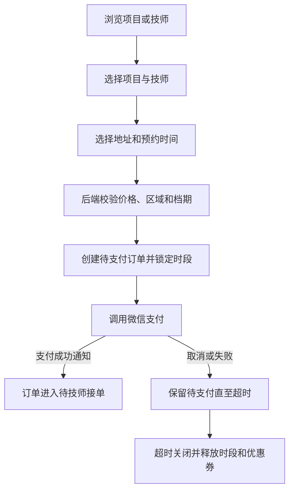
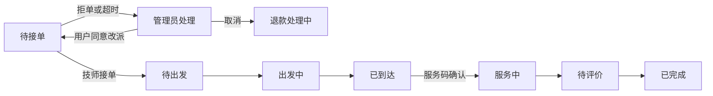

# 东莞到家按摩微信小程序 PRD

> 产品版本：V1.0  
> 文档状态：待确认  
> 产品形态：单个原生微信小程序，包含用户端、技师端和管理端  
> 服务区域：东莞市

## 1. 产品概述

### 1.1 产品定位

为东莞本地用户提供正规、透明、可预约的上门按摩服务。平台负责审核技师、配置项目和价格、承接微信支付、跟踪服务履约并处理退款、投诉和技师结算。

### 1.2 产品目标

1. 用户能够在 3 分钟内完成“选择项目、选择技师、选择时间地址并支付”的主流程。
2. 技师能够在同一个小程序中完成接单、出发、到达、服务和收入查询。
3. 管理员能够在移动端完成首版日常运营，不依赖额外 PC 后台。
4. 每笔订单的价格、支付、状态、操作人和售后处理都有完整记录。
5. 用实名认证、资质审核、服务边界和投诉机制建立正规服务信任。

### 1.3 非目标

首版不做社交动态、私聊、直播、拉新返现、会员储值、多城市、加盟体系、自动分账或自动派单。详见 [README.md](./README.md) 的业务边界。

## 2. 用户与角色

### 2.1 角色定义

| 角色 | 获得方式 | 核心权限 |
| --- | --- | --- |
| 普通用户 | 首次微信登录自动获得 | 浏览、下单、支付、取消、退款、评价、投诉 |
| 技师 | 提交入驻资料并通过管理员审核 | 用户权限 + 技师工作台、订单履约、排班、收入查询 |
| 管理员 | 超级管理员在后台预先绑定账号 | 用户权限 + 项目、技师、订单、退款、结算和内容管理 |
| 超级管理员 | 系统初始化时创建 | 管理员全部权限 + 管理员账号和权限管理 |

一个微信账号可以同时拥有多个角色。登录后默认进入上次使用的身份，可从“我的”切换身份。未获授权的用户不能通过修改前端参数进入技师端或管理端。

### 2.2 管理端子权限

| 权限组 | 权限范围 |
| --- | --- |
| 运营管理员 | 项目、技师展示、轮播图、公告和优惠券 |
| 订单客服 | 订单查询、改派、取消、退款和投诉处理 |
| 财务管理员 | 支付记录、退款审核、技师结算和对账 |
| 超级管理员 | 全部权限、管理员账号和系统配置 |

首版允许一个管理员拥有多个权限组。

## 3. 产品信息架构

### 3.1 用户身份底部导航

`首页 / 项目 / 技师 / 订单 / 我的`

### 3.2 技师身份底部导航

`工作台 / 订单 / 排班 / 收入 / 我的`

### 3.3 管理员身份底部导航

`工作台 / 订单 / 运营 / 财务 / 我的`

“运营”页面内进入项目、技师、优惠券和内容管理。页面权限由后端返回，前端不展示无权入口。

## 4. 用户端页面与功能

### 4.1 登录与授权

#### 页面

- 微信登录页
- 用户协议与隐私政策页
- 手机号绑定页
- 角色选择/切换页

#### 功能要求

- 首次使用可先浏览公开项目和技师，支付、收藏、下单前必须登录。
- 微信登录后创建平台账号并绑定微信身份。
- 手机号用于订单联系；获取手机号前必须单独说明用途并由用户主动授权。
- 用户必须同意用户协议、隐私政策和交易规则后才能提交订单。
- 被禁用账号可以浏览规则和联系客服，但不能新建订单。

### 4.2 首页

#### 页面模块

1. 顶部显示东莞市和当前服务地址。
2. 轮播图展示平台活动、服务保障和公告。
3. 项目分类快捷入口。
4. 热门项目列表，展示项目名、时长、起始价和标签。
5. 附近可约技师，展示头像、姓名、认证、评分、距离和最早可约时间。
6. 新人优惠券入口。
7. 正规服务、实名认证、售后保障和举报入口。

#### 业务规则

- 定位拒绝后允许用户手动选择东莞地址，不阻断浏览。
- 东莞市外地址不能提交订单，提示当前服务范围。
- 首页只展示已上架且当前有效的项目、技师和活动。

### 4.3 项目列表

#### 功能

- 按分类筛选项目。
- 按价格或时长排序。
- 展示项目图片、名称、简介、时长、起始价、销量和可约技师数量。
- 下拉刷新，分页加载。

“起始价”是所有可约技师当前有效价格中的最低值；没有可约技师的项目不可下单。

### 4.4 项目详情

#### 展示字段

- 项目名称、封面和详情图片
- 服务时长、项目基础价和“不同技师价格可能不同”的说明
- 服务流程、服务部位、适用人群、禁忌事项
- 用户需要准备的环境或物品
- 取消规则、服务保障和投诉入口
- 可服务技师列表

#### 操作

- 收藏项目（P1，可不进入首个可用版本）
- 分享小程序页面
- 选择技师并立即预约

### 4.5 技师列表

#### 筛选项

- 姓名关键词
- 东莞行政区
- 距离优先、评分优先、接单量优先
- 可约日期和时段
- 可服务项目

#### 列表字段

- 规范工作照、姓名/工号
- 实名认证、健康证明和技能认证标识
- 从业年限、评分、完成单量
- 距离、服务区域和最早可约时间
- 该技师可服务项目的起始价

首版只做列表模式，不做地图模式。

### 4.6 技师详情

#### 页面模块

- 工作照相册，不展示与服务无关的生活照
- 姓名/工号、简介、服务区域和距离
- 实名、健康、技能认证状态
- 从业年限、评分、完成单量和最早可约时间
- 可服务项目及每项实际价格、时长
- 可约日历
- 用户评价
- 收藏、分享、联系客服和举报

#### 隐私规则

- 不公开身份证号、证件原图、详细住址和私人手机号。
- 健康证明和技能证书只展示审核状态、证书类型和有效期月份。
- 技师联系信息只在已支付有效订单中按规则展示或通过平台中转。

### 4.7 地址管理

#### 字段

- 联系人、手机号
- 行政区、街道/镇、详细地址
- 地图经纬度
- 门牌补充说明
- 地址标签和默认地址

#### 规则

- 地址必须位于东莞服务范围。
- 下单时保存地址快照，用户之后修改地址不影响历史订单。
- 地址仅对订单关联技师和有权限管理员开放，并记录访问日志。

### 4.8 预约确认与结算

#### 必填项

- 服务地址
- 项目和数量（V1 每单只允许一种项目，数量固定为 1）
- 用户自行选择的技师
- 服务日期和开始时间
- 联系手机号

#### 选填项

- 可用优惠券
- 服务备注，限制字数并进行敏感词检查

#### 金额展示

- 项目金额
- 上门费
- 优惠金额
- 应付金额
- 价格和优惠说明

#### 提交规则

- 后端再次验证项目、技师、价格、地址和时段，不信任前端金额。
- 创建待支付订单时锁定技师时段 15 分钟。
- 用户不得选择已被占用、已请假或不在服务范围的时间。
- 提交按钮必须防重复点击，同一请求不能创建多笔订单。

### 4.9 支付结果

- 支付成功：展示订单号、预约时间、技师、地址摘要和“查看订单”。
- 支付处理中：提示正在确认，不允许重复发起新的相同订单。
- 支付失败/取消：保留待支付订单，在有效时间内允许重新支付。
- 支付结果以平台收到并验证的微信支付通知为准，前端成功页不直接修改订单状态。

### 4.10 我的订单

#### 列表标签

- 全部
- 待支付
- 待接单
- 待服务（含待出发、出发中、已到达）
- 服务中
- 待评价
- 已完成
- 退款/售后

#### 订单详情

- 订单号、状态和状态说明
- 项目、技师、服务时间和地址快照
- 金额、优惠、支付和退款信息
- 状态时间线
- 取消、支付、联系客服、申请售后、评价、再次预约等当前可用操作

### 4.11 评价与投诉

#### 评价

- 仅已完成且未评价订单可评价一次。
- 评分 1 至 5 分，可选标签和填写文字，可上传图片。
- 评价默认显示技师服务名，不显示用户手机号和详细地址。
- 管理员只可隐藏违规内容，不可修改用户评分和正文。

#### 投诉/售后

- 类型：服务质量、技师行为、收费问题、未按时到达、安全问题、其他。
- 必须关联订单，填写说明，可上传凭证。
- 展示受理、处理中、待用户补充、已解决和已关闭状态。
- 安全问题提供醒目的平台客服电话和紧急情况提示。

### 4.12 我的

- 头像、昵称、手机号
- 当前身份和角色切换
- 地址管理
- 收藏技师
- 优惠券
- 联系客服、意见反馈和投诉记录
- 协议规则、隐私政策、关于平台
- 账号注销

## 5. 技师端页面与功能

### 5.1 技师入驻申请

#### 资料

- 真实姓名、手机号、身份证明
- 正面工作照
- 从业简介和从业年限
- 可服务行政区
- 健康证明、技能证书及有效期
- 紧急联系人
- 收款信息只用于线下结算登记

#### 状态

`草稿 / 待审核 / 补充资料 / 已通过 / 已拒绝 / 已停用`

审核通过后才出现技师身份。证书即将到期或已过期时通知技师和管理员；管理员可暂停技师接单。

### 5.2 技师工作台

- 接单状态：上线/休息
- 待处理新订单
- 今日订单时间轴
- 下一单项目、时间和大致区域
- 今日完成单数、预计可结算金额
- 资质到期、投诉和管理员通知

有未完成订单时不能直接切换为长期停用，但可以设置完成当前订单后休息。

### 5.3 技师订单

#### 新订单信息

- 项目、时长、预约时间
- 地址大致区域和预计距离
- 技师预计收入
- 用户备注（过滤敏感信息）
- 接单倒计时

技师接单前不展示用户完整门牌和手机号。接单后按服务需要展示。

#### 履约操作

| 当前状态 | 技师可执行操作 | 校验 |
| --- | --- | --- |
| 待接单 | 接单、拒单 | 订单仍有效且在倒计时内 |
| 待出发 | 确认出发、联系用户、异常上报 | 已接单 |
| 出发中 | 导航、确认到达、异常上报 | 不能早于合理时间操作 |
| 已到达 | 开始服务、联系用户、异常上报 | 用户确认码或管理员授权 |
| 服务中 | 完成服务、异常上报 | 达到最低合理服务时长 |
| 待评价/已完成 | 查看订单摘要 | 不可再改履约状态 |

“开始服务”首版采用用户四位服务码；用户无法提供时由管理员审核后代为确认。

### 5.4 排班管理

- 设置未来 30 天可服务时段。
- 设置常规工作时间和临时休息。
- 查看已被订单占用的时段。
- 有有效订单的时段不能直接设为休息，需先由管理员处理订单。
- 管理员可以代技师调整排班，并记录操作日志。

### 5.5 我的项目与价格

- 技师只读查看管理员分配给自己的项目、实际价格和预计收入。
- 技师可以申请新增/停止某个项目，但不能自行修改项目名称、内容或价格。
- 所有项目变更由管理员审核生效。

### 5.6 收入与结算

- 收入概览：待服务、服务中、待结算、已结算、售后冻结。
- 明细按订单展示项目实收、上门费归属、平台服务费、技师应结金额。
- 结算记录展示结算周期、金额、订单数量、结算状态和凭证。
- 技师发现差异可以发起结算申诉。

首版不提供自动提现按钮。管理员在线下付款后，在系统中登记结算结果。

## 6. 管理端页面与功能

### 6.1 管理工作台

- 今日新增订单、支付金额、完成订单、退款金额
- 待审核技师、待接单超时、异常订单、待退款、待投诉
- 待结算技师和待结算金额
- 快捷进入订单搜索、技师审核和项目管理

### 6.2 项目分类管理

- 新建、编辑、排序、启用和停用分类。
- 停用分类不自动下架分类下项目，但用户端不再从该分类入口展示。
- 已被项目引用的分类不能物理删除。

### 6.3 项目管理

#### 字段

- 名称、分类、封面、详情图
- 简介、服务内容、服务时长
- 基础价格
- 服务须知、适用人群、禁忌事项
- 上架状态和排序

#### 规则

- 价格以人民币“分”为最小单位存储。
- 修改项目只影响后续新订单，历史订单使用下单快照。
- 下架项目后，未支付订单不可继续支付；已支付订单不受影响，由管理员决定正常履约或退款。

### 6.4 技师管理

- 入驻申请列表和资料详情
- 审核通过、要求补充、拒绝、暂停和恢复
- 查看资质及有效期
- 配置服务区域、推荐排序和上线状态
- 绑定或解绑可服务项目
- 为技师设置项目独立价格
- 查看订单、评价、投诉和结算历史

#### 技师项目价格规则

每个项目有基础价；管理员可在“技师-项目”关系上设置独立价格。有效价格按以下顺序确定：

1. 存在启用中的技师独立价格时，使用独立价格。
2. 否则使用项目基础价。
3. 项目或技师项目关系已停用时不可下单。

### 6.5 订单管理

- 按订单号、用户手机号、技师、项目、状态和日期筛选。
- 查看完整状态时间线、支付、退款、地址快照和操作日志。
- 处理技师拒单或接单超时。
- 经用户确认后改派技师。
- 管理员取消、发起退款、备注和上传处理凭证。
- 对异常状态执行受控修复，必须填写原因并记录前后状态。

### 6.6 改派规则

- 只能改派给项目可用、时段可用、服务区域匹配且审核有效的技师。
- 改派前联系用户确认。
- 首版保持用户已支付金额不变；存在价格差异时由管理员选择“平台承担、线下退款或取消重下”，并留下记录。
- 原技师和新技师均收到订阅消息。

### 6.7 退款与售后

- 查看用户申请、证据和订单时间线。
- 支持全额退款和部分退款。
- 退款金额不能超过该支付单剩余可退金额。
- 退款申请、微信退款结果和订单售后状态分别记录。
- 退款失败进入人工复核，不得直接标记为已退款。

### 6.8 优惠券管理

首版只支持平台通用满减券：

- 名称、面额、最低消费、发放数量、领取和使用时间
- 每人限领数量
- 启用、停用和手动发放
- 下单时锁券，支付成功后核销，订单关闭后释放
- 退款后是否退券按优惠券规则决定，默认不退过期券

### 6.9 轮播图、公告与协议

- 轮播图新建、编辑、排序、上下架和跳转目标。
- 平台公告发布和撤回。
- 用户协议、隐私政策、交易规则、取消规则保留版本和生效时间。
- 用户下单时保存其同意的协议版本。

### 6.10 财务与人工结算

- 支付流水和微信交易号查询
- 退款流水和退款结果查询
- 按技师和结算周期汇总可结算订单
- 创建结算单、复核、标记已付款、上传凭证
- 结算完成后订单不能重复进入新结算单
- 作废结算单需超级管理员权限和原因
- 导出功能首版提供 CSV 文件下载；小程序端生成后通过文件预览/转发处理

### 6.11 管理员与权限

- 超级管理员添加、停用管理员并分配权限组。
- 管理员不可修改自己的超级管理员权限。
- 关键操作二次确认：退款、改派、停用技师、结算付款和管理员变更。
- 所有关键操作写入不可由普通管理员删除的审计日志。

## 7. 核心业务流程

### 7.1 下单流程



### 7.2 履约流程



### 7.3 人工结算流程


## 8. 订单、支付和售后状态

### 8.1 订单主状态

| 状态 | 含义 | 主要进入条件 |
| --- | --- | --- |
| WAIT_PAY | 待支付 | 创建订单成功 |
| WAIT_ACCEPT | 待技师接单 | 微信支付确认成功 |
| WAIT_DEPART | 待出发 | 技师接单 |
| DEPARTED | 出发中 | 技师确认出发 |
| ARRIVED | 已到达 | 技师确认到达 |
| IN_SERVICE | 服务中 | 服务码或管理员确认 |
| WAIT_REVIEW | 待评价 | 技师完成服务 |
| COMPLETED | 已完成 | 用户评价或评价期结束 |
| CANCELLED | 已取消 | 未支付关闭或管理员取消 |
| AFTER_SALE | 售后处理中 | 发起退款/投诉且影响履约 |
| CLOSED | 已关闭 | 售后完成且订单终止 |

订单状态只允许按定义的状态机变化。任何绕过流程的管理员操作都要记录原因。

### 8.2 支付状态

`UNPAID / PAYING / PAID / PAY_FAILED / PART_REFUNDED / REFUNDED`

支付状态与订单主状态分开维护。例如订单可以处于 AFTER_SALE，同时支付状态为 PART_REFUNDED。

### 8.3 退款状态

`APPLIED / REVIEWING / REFUNDING / SUCCESS / FAILED / REJECTED / CANCELLED`

### 8.4 结算状态

`NOT_ELIGIBLE / ELIGIBLE / INCLUDED / PAID / FROZEN / REVERSED`

## 9. 消息通知

| 触发事件 | 用户 | 技师 | 管理员 |
| --- | --- | --- | --- |
| 支付成功 | 支付与预约确认 | 新订单提醒 | 新订单统计 |
| 技师接单 | 接单成功 | 接单确认 | - |
| 技师出发/到达 | 进度提醒 | 操作确认 | - |
| 接单超时/拒单 | 正在人工处理 | 结果提醒 | 待处理提醒 |
| 订单取消/退款 | 处理结果 | 订单变化 | 待审核/结果 |
| 服务前提醒 | 预约提醒 | 行程提醒 | - |
| 评价/投诉 | 受理结果 | 新评价或申诉通知 | 待处理提醒 |
| 资质到期 | - | 到期提醒 | 待处理提醒 |
| 结算完成 | - | 结算通知 | 操作结果 |

微信订阅消息发送失败不能阻断订单主流程，系统内消息仍需保留。

## 10. 金额与计价规则

### 10.1 价格计算

```text
项目金额 = 下单时技师项目有效单价
优惠金额 = 满足优惠券规则后的抵扣金额
应付金额 = max(项目金额 + 上门费 - 优惠金额, 0)
技师应结金额 = 按订单快照中的结算规则计算
```

### 10.2 金额快照

订单创建时保存：项目名称、服务时长、基础价、技师独立价、实际项目金额、上门费、优惠券、优惠金额、应付金额、技师预计收入和结算规则。后续配置变化不影响历史订单。

### 10.3 金额安全

- 所有金额由后端使用整数“分”计算。
- 前端只展示后端返回金额。
- 支付通知金额必须与平台支付单金额一致。
- 任何退款累计金额不得超过实付金额。

## 11. 合规、安全与隐私

1. 平台只提供正规推拿、按摩和健康放松服务，项目文案、图片和评价不得含色情或暗示性内容。
2. 技师必须实名并通过健康证明、技能材料和工作照审核后才可上架。
3. 首页、详情和下单页明确展示服务边界、投诉举报和交易规则。
4. 用户手机号、地址、技师证件和财务信息按最小权限展示。
5. 管理员查看敏感资料和所有退款、改派、结算操作必须记录日志。
6. 用户可查询隐私政策、撤回非必要授权并申请注销账号。
7. 图片上传需进行格式、大小和违规内容检查；人工审核通过后公开展示。
8. 不在日志、错误信息或导出文件名中暴露完整手机号、身份证号、支付凭据或密钥。

## 12. 非功能需求

### 12.1 性能

- 正常网络下，首页、项目和技师列表 95% 的请求在 2 秒内给出可用内容或明确加载状态。
- 提交订单和支付按钮在点击后 300 毫秒内显示处理中状态。
- 列表使用分页，图片懒加载并预留尺寸，避免页面跳动。

### 12.2 可用性

- 核心按钮触控区域不小于 44×44 像素等效尺寸。
- 一个页面只保留一个主要操作。
- 表单错误显示在对应字段附近，不只依赖红色边框。
- 固定底部按钮不得遮挡最后一行内容。
- 支付、退款和结算操作必须显示处理中、成功或失败结果。

### 12.3 可靠性

- 重复支付通知、重复订单提交和重复技师状态操作不得产生重复扣款或重复状态流转。
- 微信支付通知暂时失败时可重试并主动查单。
- 订单、支付、退款和结算的关键状态变化保留历史记录。
- 每日自动备份核心数据库，定期验证可恢复性。

### 12.4 容量目标

首版验收容量按以下业务规模设计：

- 10,000 个注册用户
- 500 名技师
- 200 名同时在线用户
- 每日 1,000 笔订单
- 每个项目或技师列表可分页浏览 10,000 条历史数据

## 13. 数据统计指标

- 访问用户数、注册用户数
- 项目详情和技师详情访问量
- 创建订单数、支付订单数和支付转化率
- 接单率、接单平均时长
- 取消率、退款率、投诉率
- 准时到达率、服务完成率
- 平均客单价、平台实收金额
- 技师完成单量和待结算金额
- 复购率和平均评分

首版只提供基础统计卡片，不建设复杂 BI 看板。

## 14. 功能优先级

### P0：必须完成才能上线

- 登录、手机号、角色权限和角色切换
- 项目、技师、排班和价格管理
- 地址、预约、订单快照和时段锁定
- 微信支付、退款和支付对账基础能力
- 技师完整履约流程
- 管理员订单、改派、退款和结算
- 用户订单、评价、投诉和协议
- 订阅消息、审计日志、隐私和合规页面

### P1：首版稳定后完成

- 优惠券完整运营能力
- 收藏项目/技师
- CSV 导出
- 更细的经营统计
- 技师结算申诉

### P2：未来候选，不属于当前承诺

- PC 管理后台
- 地图模式和实时轨迹
- 隐私号和通话录音
- 会员卡、储值和次卡
- 多城市和合伙人
- 自动派单、自动分账和自动提现

## 15. 验收标准

1. 新用户可以从微信登录开始，在 3 分钟内完成一笔指定技师的预约支付。
2. 同一技师同一时段无法被两笔有效订单同时占用。
3. 管理员修改基础价或技师独立价后，新订单采用新价格，历史订单金额不变。
4. 技师只能看到自己订单的必要用户信息，不能访问其他技师订单。
5. 管理员可以完整处理“支付、拒单、改派、履约、退款、评价、投诉、结算”闭环。
6. 重复提交订单或重复支付通知不会生成重复订单、重复支付或重复结算。
7. 每笔关键订单操作都能查到时间、操作者、前状态、后状态和原因。
8. 退款成功以微信退款结果为准，失败时保持可继续处理的状态。
9. 无权限账号无法进入技师端或管理端接口，即使伪造前端请求也会被拒绝。
10. 东莞市外地址无法提交订单，并得到清晰提示。
11. 核心流程在至少两种主流 iOS 微信环境和两种主流 Android 微信环境通过测试。
12. 微信小程序审核所需协议、隐私、资质和服务边界材料准备完整。

## 16. 风险与待确认项

### 16.1 必须在开发前确认

- [README.md](./README.md) 中 D-01 至 D-10 的业务默认值。
- 上门费具体算法和费用最终归属平台还是技师。
- 技师应结金额算法：固定比例、项目固定金额或逐技师设置。
- “完成服务”的最低合理时长阈值。
- 用户评价自动完成期限和售后保护期。
- 微信支付商户主体、服务类目和小程序主体是否已准备。

### 16.2 主要风险

- 到家按摩类目存在平台审核和内容合规风险，需在开发前确认小程序类目、主体资质和经营范围。
- 单小程序包含管理员功能不会降低后端权限要求，所有管理接口仍需服务端鉴权。
- 移动端管理大量项目和订单的效率有限，业务增长后可能需要单独建设 PC 管理后台。
- 人工结算降低了支付开发复杂度，但需要严格的结算复核和防重复机制。
- 参考截图中的私人生活照、年龄和身材信息不应作为本产品核心展示内容。
