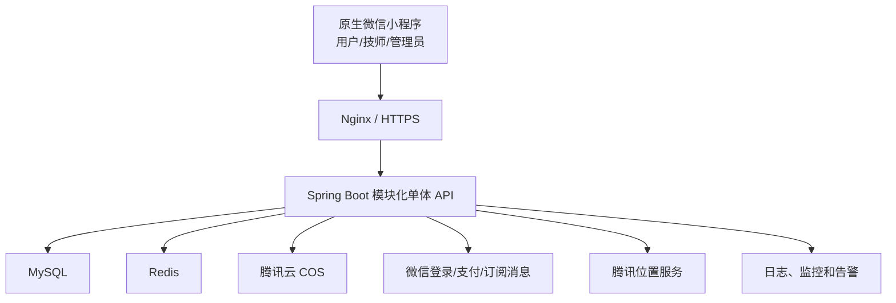

# 到家按摩小程序技术设计

> 文档状态：阶段 1 技术选型已确认并落地，后续业务设计待逐阶段确认  
> 约束：原生微信小程序 + Java Spring Boot + 单城市 + 单小程序三角色

## 1. 设计原则

1. 首版使用模块化单体，减少部署、事务和排障复杂度。
2. 三种角色共用账号、订单和支付数据，但每个接口在服务端做权限校验。
3. 订单、支付、退款和结算分别建模，不用一个状态字段承载所有流程。
4. 所有价格、项目、地址和结算规则都保存订单快照。
5. 微信支付、对象存储、地图和消息通过适配接口隔离，开发环境可以使用模拟实现。
6. 先保证可追踪、可恢复和幂等，再考虑缓存和拆分服务。

## 2. 技术栈

| 层级 | 选型 | 用途 |
| --- | --- | --- |
| 小程序 | 原生微信小程序、TypeScript | 用户、技师和管理员三角色页面 |
| UI | 微信原生组件 + 项目内轻量基础组件 | 表单、列表、弹窗、状态和导航 |
| 后端 | Java、Spring Boot | REST API 和业务逻辑 |
| 安全 | Spring Security | 登录态、角色和接口权限 |
| 数据访问 | MyBatis-Plus | 数据访问和简单分页 |
| 数据库 | MySQL 8 | 核心业务数据和事务 |
| 缓存/锁 | Redis | 登录态辅助、幂等、预约时段锁和短期缓存 |
| 数据迁移 | Flyway | 数据库版本迁移 |
| 接口文档 | OpenAPI | 联调契约和测试 |
| 文件存储 | 腾讯云 COS | 项目、技师、评价和凭证图片 |
| 地图 | 腾讯位置服务 | 地址选点、坐标和距离计算 |
| 支付 | 微信支付商户接口 | 预支付、通知、查单和退款 |
| 消息 | 微信小程序订阅消息 | 订单和审核通知 |
| 部署 | Linux、Docker、Nginx | API 部署和 HTTPS 入口 |
| 监控 | 结构化日志 + 健康检查 + 云监控 | 错误、性能和告警 |

阶段 1 已冻结以下工程版本，最终以 `pom.xml` 和 `package-lock.json` 为准：

| 组件 | 版本 |
| --- | --- |
| Java | 21 |
| Maven Wrapper | 3.9.11 |
| Spring Boot | 4.1.0 |
| MyBatis-Plus | 3.5.17 |
| springdoc OpenAPI | 3.1.0 |
| TypeScript | 5.9.3 |
| miniprogram-api-typings | 5.2.3 |
| Vitest | 4.1.10 |
| MySQL 容器 | 8.4 |
| Redis 容器 | 8.2-alpine |
| Nginx 容器 | 1.28-alpine |

## 3. 总体架构



## 4. 代码仓库建议结构

```text
relax/
├── miniapp/                  # 原生微信小程序
│   ├── miniprogram/
│   │   ├── pages/            # 公共及用户页面
│   │   ├── packageUser/      # 用户分包
│   │   ├── packageTech/      # 技师分包
│   │   ├── packageAdmin/     # 管理员分包
│   │   ├── components/
│   │   ├── services/
│   │   ├── store/
│   │   └── utils/
│   └── project.config.json
├── server/                   # Spring Boot 后端
│   ├── src/main/java/.../
│   ├── src/main/resources/
│   └── src/test/
├── deploy/                   # Docker、Nginx、环境模板
└── docs/
```

小程序采用分包，主包只保留登录、首页、角色切换和公共页面，避免三端页面一起进入首包。

## 5. 后端模块边界

| 模块 | 职责 |
| --- | --- |
| auth | 微信登录、平台令牌、手机号绑定、账号状态 |
| iam | 用户、角色、权限、管理员权限组 |
| region | 东莞行政区、服务范围、地址和距离 |
| technician | 入驻申请、资料、证书、服务区域、状态 |
| catalog | 项目分类、项目、技师项目和独立价格 |
| schedule | 排班、请假、预约占用和时间锁 |
| order | 下单、快照、状态机、改派和操作日志 |
| payment | 支付单、微信预支付、通知、查单和对账 |
| refund | 退款申请、审核、微信退款和结果通知 |
| coupon | 优惠券模板、用户券、锁定和核销 |
| review | 用户评价、图片和内容审核 |
| aftersale | 投诉、售后工单和处理记录 |
| settlement | 技师收入台账、结算单、付款凭证和申诉 |
| content | 轮播图、公告、协议和系统配置 |
| notification | 站内消息和微信订阅消息 |
| file | 上传凭证、COS 临时授权和文件元数据 |
| audit | 管理操作和敏感数据访问日志 |

模块之间通过应用服务调用，不在首版引入消息队列。支付通知后的非关键订阅消息可以由数据库任务表异步重试。

## 6. 登录、角色和权限

### 6.1 登录流程

1. 小程序调用微信登录获得一次性登录凭证。
2. 后端向微信换取用户微信身份标识。
3. 后端创建或查找平台用户，返回平台访问令牌、账号状态和角色列表。
4. 小程序保存平台令牌，不保存微信会话密钥。
5. 每次请求携带平台令牌；后端解析当前用户并检查角色、权限和资源归属。

### 6.2 角色切换

角色切换只改变小程序页面和当前工作台，不生成更高权限。后端始终根据数据库中已生效角色鉴权，不相信前端声明的角色。

### 6.3 权限示例

| 权限码 | 说明 |
| --- | --- |
| project:read/write | 查看/管理项目 |
| technician:audit | 审核技师 |
| order:read/manage/refund | 查看、处理、退款订单 |
| settlement:read/manage | 查看、创建和确认结算 |
| admin:manage | 管理管理员和权限 |

除了功能权限，还要检查数据范围：技师只能访问 `technician_id` 为自己的订单；用户只能访问 `user_id` 为自己的订单。

## 7. 核心数据模型

### 7.1 账号与权限

| 表 | 核心字段 |
| --- | --- |
| user | id, wechat_open_id, union_id, nickname, avatar, phone, status, last_role |
| role | id, code, name, status |
| permission | id, code, name |
| user_role | user_id, role_id, status, granted_by, granted_at |
| role_permission | role_id, permission_id |
| admin_profile | user_id, name, status |

### 7.2 地址与区域

| 表 | 核心字段 |
| --- | --- |
| region | id, parent_id, name, level, code, status |
| service_area | id, region_id, name, boundary/config, status |
| user_address | id, user_id, contact_name, phone, region_id, detail, longitude, latitude, is_default |

### 7.3 技师与资质

| 表 | 核心字段 |
| --- | --- |
| technician | id, user_id, service_name, real_name, phone, intro, experience_years, status, online_status |
| technician_application | id, user_id, payload_snapshot, status, reject_reason, reviewer_id |
| technician_certificate | id, technician_id, type, file_id, certificate_no_masked, valid_from, valid_to, audit_status |
| technician_photo | id, technician_id, file_id, type, sort, audit_status |
| technician_service_area | technician_id, service_area_id |

### 7.4 项目与技师定价

| 表 | 核心字段 |
| --- | --- |
| service_category | id, name, sort, status |
| service_project | id, category_id, name, duration_minutes, base_price, description, notice, status, sort |
| technician_project | id, technician_id, project_id, override_price, settlement_rule_snapshot/config, status |

`override_price` 为空时使用项目基础价；不为空时必须大于 0。一个技师和一个项目只允许一条当前关系。

### 7.5 排班与档期

| 表 | 核心字段 |
| --- | --- |
| technician_schedule | id, technician_id, date, start_time, end_time, type, status |
| schedule_lock | id, technician_id, order_no, start_at, end_at, expire_at, status |

数据库需要防止同一技师有效时间段重叠。Redis 锁用于降低并发竞争，数据库事务和唯一/冲突校验是最终保障。

### 7.6 订单

| 表 | 核心字段 |
| --- | --- |
| service_order | id, order_no, user_id, technician_id, project_id, status, service_start_at, service_end_at, version |
| order_project_snapshot | order_id, project_name, duration, base_price, override_price, actual_price, content_snapshot |
| order_address_snapshot | order_id, contact_name, phone, region_name, detail, longitude, latitude |
| order_amount | order_id, project_amount, travel_fee, discount_amount, payable_amount, paid_amount, refunded_amount |
| order_assignment | id, order_id, from_technician_id, to_technician_id, reason, user_confirmed, operator_id |
| order_status_log | id, order_id, from_status, to_status, operator_type, operator_id, reason, created_at |
| order_operation | id, order_id, operation, request_id, payload摘要, operator_id, created_at |

`version` 用于乐观锁，防止技师和管理员同时改变订单状态。

### 7.7 支付与退款

| 表 | 核心字段 |
| --- | --- |
| payment_order | id, payment_no, order_id, channel, amount, status, prepay_id, transaction_id, expire_at |
| payment_notify | id, notify_id, payment_no, raw_digest, process_status, received_at |
| refund_order | id, refund_no, payment_id, order_id, amount, reason, status, operator_id |
| refund_notify | id, refund_notify_id, refund_no, process_status, received_at |

原始支付通知不得明文长期保存敏感字段；保留验证、追踪所需摘要和微信交易号。

### 7.8 优惠券、评价与售后

| 表 | 核心字段 |
| --- | --- |
| coupon_template | id, name, amount, min_spend, total_count, start_at, end_at, status |
| user_coupon | id, user_id, template_id, status, locked_order_id, used_at |
| review | id, order_id, user_id, technician_id, score, content, status |
| after_sale_case | id, case_no, order_id, user_id, type, content, status, assignee_id |
| after_sale_record | id, case_id, operator_id, action, content, created_at |

### 7.9 收入与结算

| 表 | 核心字段 |
| --- | --- |
| technician_income | id, order_id, technician_id, gross_amount, platform_fee, payable_amount, status |
| settlement_batch | id, settlement_no, technician_id, period_start, period_end, total_amount, status |
| settlement_item | settlement_id, income_id, order_id, amount |
| settlement_payment | id, settlement_id, paid_at, amount, method, reference_no, proof_file_id, operator_id |

`settlement_item.income_id` 必须唯一，避免一个收入明细被重复结算。

### 7.10 内容、文件和审计

| 表 | 核心字段 |
| --- | --- |
| banner | id, title, image_file_id, link_type, link_value, sort, status |
| agreement | id, type, version, content, effective_at, status |
| user_agreement | user_id, agreement_id, agreed_at, context |
| file_asset | id, owner_type, owner_id, object_key, mime_type, size, audit_status |
| notification | id, user_id, type, title, content, read_at, send_status |
| audit_log | id, operator_id, action, resource_type, resource_id, before_digest, after_digest, ip, created_at |

## 8. API 边界

统一前缀建议为 `/api/v1`。以下为资源级契约，不代表最终 URL 已冻结。

### 8.1 公共与登录

- `POST /auth/wechat-login`：微信登录
- `POST /auth/bind-phone`：绑定手机号
- `GET /me`：当前用户、角色和权限
- `PUT /me/last-role`：记录最后使用身份
- `GET /agreements/{type}`：读取当前协议

### 8.2 用户端

- `GET /home`：首页聚合数据
- `GET /projects`、`GET /projects/{id}`
- `GET /technicians`、`GET /technicians/{id}`
- `GET /technicians/{id}/availability`
- `GET/POST/PUT/DELETE /addresses`
- `POST /orders/preview`：校验并返回价格预览
- `POST /orders`：创建待支付订单
- `GET /orders`、`GET /orders/{orderNo}`
- `POST /orders/{orderNo}/cancel`
- `POST /orders/{orderNo}/service-code/verify`
- `POST /orders/{orderNo}/reviews`
- `POST /orders/{orderNo}/after-sales`

### 8.3 支付与退款

- `POST /orders/{orderNo}/payments`：创建/重新创建支付单
- `POST /payments/wechat/notify`：支付通知，不使用用户登录鉴权，使用微信签名验证
- `GET /payments/{paymentNo}`：支付状态
- `POST /admin/refunds`：管理员发起退款
- `POST /refunds/wechat/notify`：退款通知

### 8.4 技师端

- `POST /technician-applications`
- `GET /technician/workbench`
- `PUT /technician/online-status`
- `GET /technician/orders`
- `POST /technician/orders/{orderNo}/accept`
- `POST /technician/orders/{orderNo}/reject`
- `POST /technician/orders/{orderNo}/depart`
- `POST /technician/orders/{orderNo}/arrive`
- `POST /technician/orders/{orderNo}/complete`
- `GET/PUT /technician/schedules`
- `GET /technician/incomes`
- `GET /technician/settlements`

### 8.5 管理端

- `GET /admin/dashboard`
- `GET/POST/PUT /admin/categories`
- `GET/POST/PUT /admin/projects`
- `GET /admin/technicians`、`PUT /admin/technicians/{id}/audit`
- `PUT /admin/technicians/{id}/projects/{projectId}`
- `GET /admin/orders`、`GET /admin/orders/{orderNo}`
- `POST /admin/orders/{orderNo}/reassign`
- `POST /admin/orders/{orderNo}/force-transition`
- `GET/POST/PUT /admin/coupons`
- `GET/POST/PUT /admin/banners`
- `GET/POST/PUT /admin/agreements`
- `GET/POST/PUT /admin/settlements`
- `GET/POST/PUT /admin/admin-users`
- `GET /admin/audit-logs`

## 9. 统一接口约定

### 9.1 响应

```json
{
  "code": "OK",
  "message": "",
  "data": {},
  "requestId": "..."
}
```

业务错误使用稳定错误码，例如 `SCHEDULE_OCCUPIED`、`PRICE_CHANGED`、`ORDER_STATE_INVALID`，小程序按错误码给出明确处理方式。

### 9.2 分页

列表统一使用 `pageNo`、`pageSize`，返回 `items`、`total` 和 `hasMore`。管理端导出使用异步导出任务，避免一次查询过多数据。

### 9.3 幂等

创建订单、发起支付、技师状态操作、退款和结算确认都携带请求幂等键。服务端保存处理结果，同一用户重复发送同一键时返回首次结果。

## 10. 预约并发设计

创建订单必须在一个业务事务中完成：

1. 校验用户、项目、技师和服务范围。
2. 计算项目有效价和优惠。
3. 获取技师时段短锁。
4. 再次查询数据库确认没有重叠有效订单或锁。
5. 创建订单快照、金额和 15 分钟时段锁。
6. 提交事务后释放 Redis 短锁。

待支付订单超时任务关闭订单并释放档期、优惠券。即使超时任务延迟，创建新订单时也应把已过期锁视为无效。

## 11. 订单状态机设计

- 状态变化集中在订单领域服务中，控制器不能直接更新状态字段。
- 每个动作声明允许的前置状态、操作者、额外条件和目标状态。
- 状态变更与状态日志在同一数据库事务提交。
- 技师状态动作使用订单 `version` 做乐观锁。
- 管理员强制修复需要专用接口、特殊权限、二次确认和原因。

## 12. 支付接口预留设计

### 12.1 支付抽象

```text
PaymentGateway
├── createPayment
├── queryPayment
├── closePayment
├── verifyAndParseNotify
├── createRefund
└── queryRefund

实现：MockPaymentGateway / WechatPaymentGateway
```

抽象只覆盖当前需要的微信支付能力，不提前设计支付宝、多商户或分账。

### 12.2 支付流程

1. 后端创建平台支付单和唯一支付单号。
2. 后端调用微信创建预支付交易，返回小程序调起支付所需参数。
3. 小程序调起微信支付。
4. 微信异步通知后端，后端验证签名、商户、金额和订单号。
5. 在事务中把支付单改为已支付，并把订单从 WAIT_PAY 改为 WAIT_ACCEPT。
6. 返回微信成功响应，再异步写通知和订阅消息任务。
7. 小程序主动查询平台支付状态，不凭本地支付成功回调直接认定到账。

### 12.3 支付幂等与补偿

- 微信通知 ID 唯一，重复通知直接返回已处理结果。
- 同一业务订单最多只有一个有效待支付支付单。
- 定时任务查询长时间处于 PAYING 的支付单。
- 已到账但订单未更新时允许补偿任务恢复订单状态。
- 超时关闭订单前先查询可能处于支付中的支付单。

### 12.4 退款

- 退款由有权限管理员发起，首版不允许前端绕过审核直接调用微信退款。
- 创建退款单后调用微信；请求受理不等于退款成功。
- 退款通知或主动查询确认成功后，才更新已退款金额和支付状态。
- 部分退款和多次退款累计不能超过实付金额。

## 13. 人工结算设计

1. 订单完成且过售后保护期后生成或解冻技师收入明细。
2. 管理员选择技师和结算周期，系统只拉取 ELIGIBLE 明细。
3. 创建结算单时将明细置为 INCLUDED，防止重复选择。
4. 财务线下付款后录入付款时间、方式、参考号和凭证。
5. 超级管理员或财务复核后标记 PAID。
6. 售后发生在结算后时创建反向调整明细，不直接修改历史已结算金额。

## 14. 文件上传设计

- 小程序先向后端申请上传参数，再上传至对象存储。
- 后端校验文件用途、格式、大小、归属和数量。
- 技师工作照、资质、评价图和结算凭证使用不同目录和访问权限。
- 私有证件使用私有存储和短时签名 URL，不能用永久公开地址。
- 文件只有通过审核并绑定业务记录后才能公开展示。

## 15. 安全设计

- 全站 HTTPS，配置严格的跨域和域名白名单。
- 微信、支付和 COS 密钥只存于服务端环境变量或密钥服务。
- 登录、支付、短信/手机号和管理接口做频率限制。
- SQL 使用参数化查询；富文本在入库或展示前做白名单清洗。
- 手机号、身份证、地址和收款信息加密或脱敏存储/展示。
- 普通业务日志不打印请求令牌、支付通知密文和完整敏感字段。
- 管理员接口需要角色权限；退款和结算可以增加操作密码或二次确认。
- 审计日志只追加，不提供普通删除接口。

## 16. 定时任务

| 任务 | 建议频率 | 作用 |
| --- | --- | --- |
| 关闭超时未支付订单 | 每分钟 | 释放时段和优惠券 |
| 检查接单超时 | 每分钟 | 转管理员处理并通知 |
| 支付状态补偿 | 每 5 分钟 | 主动查单恢复异常支付 |
| 退款状态补偿 | 每 10 分钟 | 查询处理中退款 |
| 服务前提醒 | 每 5 分钟 | 发送即将开始提醒 |
| 自动完成待评价订单 | 每小时 | 评价期结束后完成 |
| 生成可结算收入 | 每小时/每天 | 售后保护期结束后解冻 |
| 资质到期提醒 | 每天 | 提醒技师和管理员 |
| 消息失败重试 | 每分钟 | 重试可恢复通知 |
| 数据备份 | 每天 | 备份和保留策略 |

单体部署首版只运行一个调度实例；扩容到多实例时需使用数据库锁避免任务重复执行。

## 17. 环境与部署

### 17.1 环境

- local：本地开发，模拟支付和本地/测试对象存储
- test：前后端联调和自动化测试
- staging：接近生产配置，用于验收和微信体验版
- production：正式环境

各环境使用独立数据库、Redis、文件目录和微信配置，不共用生产数据。

### 17.2 生产最小部署

- 1 台应用服务器运行 Nginx 和 Spring Boot 容器
- 云数据库 MySQL
- 云 Redis
- 腾讯云 COS
- HTTPS 证书和已备案 API 域名
- 云日志、CPU/内存/磁盘和接口错误告警

正式上线后根据监控扩容，不在首版引入 Kubernetes。

## 18. 测试策略

| 层级 | 重点 |
| --- | --- |
| 单元测试 | 价格、优惠、状态机、权限、结算和退款金额 |
| 数据库集成测试 | 时段冲突、事务、唯一约束、乐观锁和迁移 |
| API 测试 | 登录、资源归属、错误码、幂等和分页 |
| 支付契约测试 | 模拟支付、重复通知、金额不符、查单和退款 |
| 小程序测试 | 三角色导航、表单、空态、弱网和重复点击 |
| 端到端测试 | 下单支付、履约、取消退款、投诉和结算全链路 |
| 安全测试 | 越权访问、敏感数据、上传、频率限制和日志泄漏 |

## 19. 技术验收门槛

- 所有数据库变更都有可重复执行的迁移文件。
- 核心状态机、金额计算、时段并发和权限规则有自动化测试。
- 测试环境可以在不连接真实微信支付的情况下跑通全流程。
- 支付和退款通知通过重复通知、乱序通知和金额不符测试。
- 用户、技师和管理员互相越权访问均被服务端拒绝。
- 日志能按 requestId、订单号、支付单号和退款单号追踪。
- 生产密钥不进入 Git 仓库或小程序代码包。
- 上线前完成数据库备份和至少一次恢复演练。

## 20. 技术未决项

1. 微信开发者工具和正式小程序基础库版本需在 AppID 与测试设备就绪后冻结；Java 和工程依赖版本已在阶段 1 冻结。
2. 微信支付商户 API 证书、商户号、回调域名和主体资质由项目方提供。
3. 技师收入计算规则需业务确认后才能确定数据字段和计算器。
4. 东莞服务范围采用行政区白名单还是地图围栏，首版推荐行政区白名单加地址坐标复核。
5. 对象存储、地图和服务器最终使用的腾讯云账号及地域由项目方提供。

当前环境未提供 Context7 查询端点；阶段 1 版本通过 Spring Initializr、Maven Central 和 npm 官方元数据核对。进入微信登录、支付等后续阶段时，仍须在编码前重新核对对应官方文档与账号能力。
